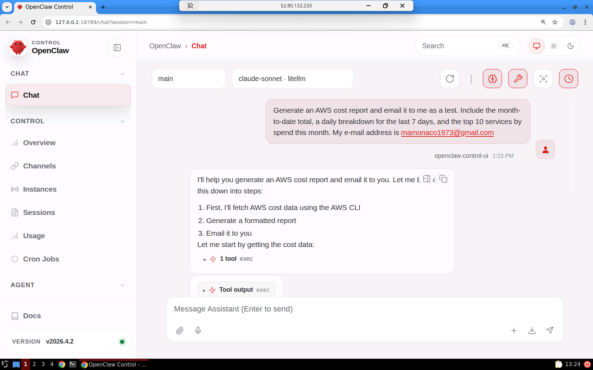
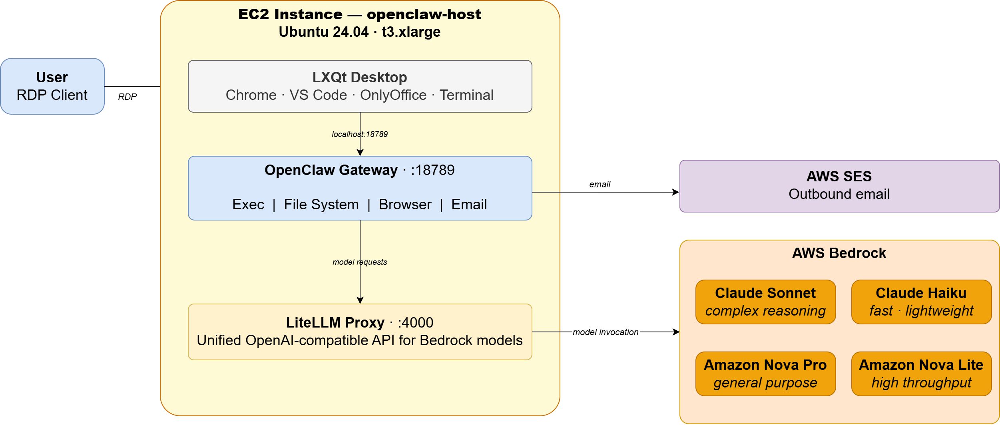

# AI Agent Workstation on AWS with OpenClaw, LiteLLM, and Bedrock

This project delivers a fully automated **AI agent workstation** on AWS, built
using **Terraform**, **Packer**, and **OpenClaw** — an agentic coding and task
automation platform backed by **AWS Bedrock** foundation models via a
**LiteLLM proxy**.

It provisions a hardened **Ubuntu 24.04 EC2 instance** with a full **LXQt
desktop environment** accessible over **RDP**, pre-loaded with developer
tooling, cloud CLIs, and a running OpenClaw gateway — ready to accept work
from the moment you connect.

Users RDP into the desktop and interact with OpenClaw through its web interface
at `http://localhost:18789`. The agent has full access to the local filesystem,
terminal, browser, and AWS services via the instance IAM role — no credentials
to manage, no keys to rotate.



OpenClaw is backed by four **AWS Bedrock** models available for selection at
runtime: **Claude Sonnet**, **Claude Haiku**, **Amazon Nova Pro**, and
**Amazon Nova Lite** — all routed through a locally running **LiteLLM proxy**
so the agent works with any model without configuration changes.

Outbound **email** is configured automatically at boot using **AWS SES** SMTP
credentials retrieved from Secrets Manager, giving the agent the ability to
send reports, notifications, and file attachments without any manual setup.

---

## Key Capabilities Demonstrated

1. **Autonomous AI Agent** — OpenClaw operates as a fully autonomous coding
   and task agent. It can write and execute code, browse the web, manipulate
   files, call AWS APIs, and send email — all driven by natural language
   instructions.
2. **AWS Bedrock Model Integration** — Four foundation models (Claude Sonnet,
   Claude Haiku, Amazon Nova Pro, Amazon Nova Lite) are available via LiteLLM
   proxy running on loopback. Model selection requires no code changes — switch
   at any time in the OpenClaw UI.
3. **Fully Automated Provisioning** — A single `apply.sh` command provisions
   the VPC, builds the AMI with Packer, and deploys the EC2 instance with
   Terraform. Bedrock model IDs are resolved dynamically from the live API.
4. **Zero Credential Management** — The EC2 instance authenticates to Bedrock,
   Secrets Manager, and Cost Explorer through its IAM instance profile. No
   access keys are stored on disk or in code.
5. **Pre-Configured Desktop Environment** — LXQt desktop with Google Chrome,
   Visual Studio Code, OnlyOffice, a file manager, and terminal — all pinned
   to the desktop and ready on first login.
6. **Integrated Email via SES** — msmtp is configured system-wide at boot
   using SMTP credentials from Secrets Manager. The agent can send plain text
   email, HTML email, and file attachments using the standard `mail` command.
7. **Infrastructure as Code** — Terraform manages all AWS resources across
   three phases (core networking, AMI build, EC2 host) in a fully repeatable,
   auditable way. Packer builds the AMI from a clean Ubuntu 24.04 base with
   no dependencies on a pre-built image.

---

## Architecture



The deployment spans three Terraform phases backed by a Packer AMI build.
**01-core** establishes the network foundation — a VPC with public and private
subnets, a NAT gateway for egress, and the SES email identity with its SMTP
credentials stored in Secrets Manager. **02-packer** builds the `openclaw_ami`
from a clean Ubuntu 24.04 base, installing the full LXQt desktop, developer
tooling, and the OpenClaw and LiteLLM services. **03-openclaw** launches the
EC2 instance from that AMI into the public subnet, attaches an IAM instance
profile for credential-free access to Bedrock and Secrets Manager, and runs
`userdata.sh` at first boot to wire everything together.

At runtime, the user connects via RDP to the LXQt desktop and opens OpenClaw
in Chrome. Prompts flow from the OpenClaw gateway to the LiteLLM proxy running
on loopback, which routes model requests to AWS Bedrock — keeping all inference
traffic within AWS. The instance IAM role handles authentication throughout, so
no access keys ever touch the filesystem. Outbound email routes through AWS SES
using SMTP credentials that `userdata.sh` pulls from Secrets Manager on first
boot.


## Key Resources

| Resource | Value |
|---|---|
| Region | `us-east-1` |
| VPC / CIDR | `clawd-vpc` / `10.0.0.0/23` |
| Instance tag | `openclaw-host` |
| Instance type | `t3.xlarge` (variable) |
| LiteLLM port | `4000` (loopback) |
| OpenClaw gateway port | `18789` (loopback) |
| Linux user | `openclaw` |
| Password source | Secrets Manager `openclaw_credentials` |
| Email credentials | Secrets Manager `openclaw_ses_smtp` |

---

## Prerequisites

* [An AWS Account](https://aws.amazon.com/console/)
* [Install AWS CLI](https://docs.aws.amazon.com/cli/latest/userguide/getting-started-install.html)
* [Install Terraform](https://developer.hashicorp.com/terraform/install)
* [Install Packer](https://developer.hashicorp.com/packer/install)
* An RDP client (Windows built-in, macOS Microsoft Remote Desktop, or Remmina on Linux)

If this is your first time following along, we recommend starting with this video:
**[AWS + Terraform: Easy Setup](https://www.youtube.com/watch?v=9clW3VQLyxA)** — it walks through configuring your AWS credentials, Terraform backend, and CLI environment.

> **Bedrock Model Access:** Before deploying, enable model access in your AWS
> account for all four models used by this project:
> - `anthropic.claude-sonnet-4-5-20250929-v1:0`
> - `anthropic.claude-haiku-4-5-20251001-v1:0`
> - `amazon.nova-pro-v1:0`
> - `amazon.nova-lite-v1:0`
>
> Enable them in the [Bedrock Model Access console](https://console.aws.amazon.com/bedrock/home#/modelaccess).

> **SES Email Verification:** During `01-core` deployment you will be prompted
> for an email address to use as the SES sender identity. AWS will send a
> verification email to that address — click the link before attempting to send
> outbound email from the agent. Until verified, SES will reject all sends.

---

## Download this Repository

```bash
git clone https://github.com/mamonaco1973/aws-openclaw.git
cd aws-openclaw
```

---

## Build the Code

Run [check_env.sh](check_env.sh) to validate your environment, then run
[apply.sh](apply.sh) to provision all infrastructure and build the AMI.

```bash
~/aws-openclaw$ ./apply.sh
NOTE: Validating required commands in PATH.
NOTE: Found required command: aws
NOTE: Found required command: terraform
NOTE: Found required command: jq
NOTE: Found required command: packer
NOTE: All required commands are available.
NOTE: AWS CLI authentication successful.
NOTE: Checking Bedrock model access...
NOTE: Claude Sonnet — OK
NOTE: Claude Haiku — OK
NOTE: Amazon Nova Pro — OK
NOTE: Amazon Nova Lite — OK
NOTE: Building core infrastructure...

Initializing the backend...
```

`apply.sh` performs the following steps in order:

1. Runs `check_env.sh` to validate required CLI tools and Bedrock model access
2. Deploys `01-core` — VPC, subnets, NAT gateway, SES identity, SMTP secret
3. Resolves VPC and subnet IDs from Terraform outputs for the Packer build
4. Runs `packer build` against `02-packer/openclaw.pkr.hcl` to produce `openclaw_ami`
5. Queries `aws bedrock list-foundation-models` to resolve the latest active model IDs
6. Deploys `03-openclaw` — EC2 instance, IAM role, security group, password secret
7. Runs `validate.sh` and prints the RDP connection details

To tear down all resources:

```bash
./destroy.sh
```

> **Note:** `destroy.sh` deregisters the Packer-built AMI and deletes its
> snapshot before destroying the Terraform state, so no orphaned AMIs are left
> behind.

---

### Build Results

When the deployment completes, the following resources are created:

- **Networking (01-core):**
  - VPC `clawd-vpc` with CIDR `10.0.0.0/23`
  - Public subnets `pub-subnet-1` / `pub-subnet-2` with internet gateway
  - Private subnets `vm-subnet-1` / `vm-subnet-2` with NAT gateway for egress
  - Elastic IP for the NAT gateway

- **Email (01-core):**
  - **SES Email Identity** — registers your sender address with AWS Simple
    Email Service (requires one-time verification click)
  - **IAM SMTP User** — dedicated IAM user with `ses:SendRawEmail` permission
    scoped to the verified identity
  - **Secrets Manager secret** `openclaw_ses_smtp` — stores SMTP host, port,
    username, password, and from address; retrieved at instance boot by
    `userdata.sh`

- **AMI (02-packer):**
  - Ubuntu 24.04 base image built in `pub-subnet-1` using an `m5.xlarge`
    builder instance
  - **LXQt** lightweight desktop environment with **XRDP** for remote access
    at 16-bit color depth
  - **Xvfb** virtual framebuffer on `:99` for headless browser operation
    (used by the OpenClaw browser tool when no RDP session is active)
  - **Google Chrome**, **Visual Studio Code**, **OnlyOffice Desktop Editors**,
    **PCManFM-Qt** file manager, **QTerminal**
  - **AWS CLI v2**, **Azure CLI**, **Google Cloud SDK**, **Terraform**, **Packer**, **Git**
  - **Node.js 22**, **pnpm**, **OpenClaw** installed globally
  - **LiteLLM proxy** in a Python venv at `/opt/litellm-venv`
  - **Python tools** — python-docx, python-pptx, openpyxl, pandas, numpy,
    matplotlib, pymupdf, reportlab, beautifulsoup4, httpx, rich, and more
  - **System utilities** — ffmpeg, imagemagick, pandoc, poppler-utils,
    ghostscript, sqlite3, jq, xmlstarlet, csvkit, msmtp
  - **OpenClaw config pre-stamped** — gateway metadata written at build time
    so no cold-start config generation on first launch
  - **Exec allowlist pre-configured** — both `*` and `main` agent entries
    set to allow all paths (`/**`) so the agent can run commands immediately
  - Desktop shortcuts pinned for all applications

- **EC2 Instance (03-openclaw):**
  - `t3.xlarge` instance launched from `openclaw_ami` with a 128 GB gp3 root
    volume
  - Public IP assigned; port 3389 open for direct RDP access
  - **IAM instance profile** (`openclaw-role`) grants:

    | Policy | Purpose |
    |---|---|
    | `AmazonSSMManagedInstanceCore` | SSM Session Manager (shell access without SSH) |
    | `openclaw-bedrock` | `bedrock:InvokeModel` and `InvokeModelWithResponseStream` on all foundation models and inference profiles |
    | `openclaw-secrets` | `secretsmanager:GetSecretValue` scoped to `openclaw_credentials*` and `openclaw_ses_smtp*` |
    | `openclaw-cost-explorer` | `ce:GetCostAndUsage`, `ce:GetCostForecast`, and related Cost Explorer read APIs |

  - **`userdata.sh`** runs at first boot:
    1. Reads `openclaw_credentials` from Secrets Manager and sets the
       `openclaw` Linux user password via `chpasswd`
    2. Writes `/opt/openclaw/litellm-config.yaml` with the actual Bedrock
       model IDs resolved by `apply.sh`
    3. Reads `openclaw_ses_smtp` from Secrets Manager and writes
       `/etc/msmtprc` and `~/.msmtprc` with SMTP credentials, then
       installs a nightly cron job (8 AM UTC) for an AWS cost report email
    4. Starts `litellm.service` and `openclaw-gateway.service`

- **Systemd Services:**
  - `xvfb.service` — Xvfb virtual framebuffer, starts before gateway
  - `litellm.service` — LiteLLM proxy, reads `/opt/openclaw/litellm-config.yaml`
  - `openclaw-gateway.service` — OpenClaw gateway on loopback port 18789,
    `--auth none` so no device pairing is required

---

## Connecting to the Instance

After `apply.sh` completes, the instance's public IP is printed by `validate.sh`.

### Direct RDP

Connect your RDP client to the instance's public IP on port `3389`.

```
Host:     <public-ip>:3389
Username: openclaw
Password: (retrieved below)
```

### SSM Port-Forward (no inbound RDP required)

```bash
INSTANCE_ID=$(cd 03-openclaw && terraform output -raw instance_id)

aws ssm start-session \
  --target "$INSTANCE_ID" \
  --document-name AWS-StartPortForwardingSession \
  --parameters '{"portNumber":["3389"],"localPortNumber":["13389"]}' \
  --region us-east-1
```

Then connect your RDP client to `localhost:13389`.

### Getting the Password

```bash
aws secretsmanager get-secret-value \
  --secret-id openclaw_credentials \
  --query SecretString \
  --output text | jq -r '.password'
```

---

## Using OpenClaw

Once connected via RDP, the LXQt desktop loads automatically. Double-click
**Google Chrome** on the desktop — it opens to `http://localhost:18789`, the
OpenClaw web interface.

### Selecting a Model

Click the model selector in the OpenClaw toolbar. Four models are available:

| Model | Best for |
|---|---|
| **Claude Sonnet** | Complex reasoning, multi-step coding tasks, analysis |
| **Claude Haiku** | Fast responses, simple tasks, iteration |
| **Amazon Nova Pro** | General purpose, strong instruction following |
| **Amazon Nova Lite** | High throughput, cost-efficient tasks |

### Agent Capabilities

OpenClaw's `main` agent has full access to:

| Capability | Details |
|---|---|
| **Exec** | Run any shell command — bash, Python, AWS CLI, cron, etc. |
| **File system** | Read, write, and manage files anywhere under the home directory |
| **Browser** | Open URLs, extract page content, take screenshots via headless Chrome |
| **Email** | Send plain text and attachments via `mail` (msmtp + SES) |
| **AWS APIs** | Full access via the instance IAM role — no credentials needed |

The agent's workspace is at `~/.openclaw/workspace` (also accessible as
`~/Openclaw/workspace` via symlink). A `SYSTEM.md` file in the workspace
describes all available tools, commands, and capabilities so the agent knows
what it can do without being told.

---

## Demo: AWS Cost Report

This demo shows OpenClaw autonomously generating an AWS cost report and
scheduling it as a nightly recurring task — using only natural language
instructions.

### What the Cost Report Contains

A well-formed cost report includes:

- **Month-to-date total** — total blended spend from the first of the current
  month through yesterday, in USD
- **Daily breakdown for the last 7 days** — one line per day showing the date
  and that day's total spend, so you can spot anomalies or unexpected spikes
- **Top 10 services this month** — ranked by spend, showing the service name
  and month-to-date cost for each, so you can immediately see what is driving
  the bill

The report is sent as an email to the verified SES address configured at
deployment time.

### Step 1 — Generate and Send a Test Report

Paste this prompt into OpenClaw:

> Generate an AWS cost report with the month-to-date total, a daily breakdown for the last 7 days, and the top 10 services by spend this month. Send it as a formatted HTML email to XXXXXXXX using msmtp directly and make that e-mail address the sender.

OpenClaw will use the AWS CLI to query Cost Explorer, format the report, and
send it via the `mail` command. It knows the recipient from the msmtp
configuration and knows the AWS CLI is available via the instance IAM role —
no additional instructions needed. Confirm the email arrives and the numbers
look correct before proceeding.

### Step 2 — Schedule it as a Nightly Report

Once you have verified the test email, paste this prompt:

> Schedule that as a nightly report.

OpenClaw will save the script it just wrote, make it executable, and add a
crontab entry to run it on a schedule. It will show you the registered crontab
entry so you can confirm the schedule before the conversation ends.

---

## Packer Build Scripts

The AMI is built from Ubuntu 24.04 using the following scripts in order:

| Script | Purpose |
|---|---|
| `01-packages.sh` | Removes snap, installs SSM agent DEB, base packages |
| `02-desktop.sh` | LXQt desktop environment |
| `03-xrdp.sh` | XRDP + LXQt session configuration |
| `04-chrome.sh` | Google Chrome Stable |
| `05-tools.sh` | Git, AWS CLI v2, Terraform, Packer, Azure CLI, gcloud, VS Code |
| `06-user.sh` | `openclaw` Linux user with passwordless sudo |
| `07-node.sh` | Node.js 22, pnpm, OpenClaw global install |
| `08-litellm.sh` | LiteLLM proxy in Python venv at `/opt/litellm-venv` |
| `09-openclaw-init.sh` | Runs gateway briefly to stamp config; configures LiteLLM provider and exec allowlist; writes `SYSTEM.md` |
| `10-services.sh` | Installs and enables systemd service units; sets up desktop icons and symlinks |
| `11-python-tools.sh` | Python packages and system utilities for agent use |
| `12-onlyoffice.sh` | OnlyOffice Desktop Editors |

---

## IAM Permissions Summary

The `openclaw-role` instance profile grants the following permissions:

| Policy | Actions | Scope |
|---|---|---|
| `AmazonSSMManagedInstanceCore` | SSM Session Manager | AWS managed |
| `openclaw-bedrock` | `InvokeModel`, `InvokeModelWithResponseStream` | All foundation models and inference profiles |
| `openclaw-secrets` | `GetSecretValue` | `openclaw_credentials*`, `openclaw_ses_smtp*` |
| `openclaw-cost-explorer` | `GetCostAndUsage`, `GetCostForecast`, and related reads | `*` (Cost Explorer requires resource `*`) |

