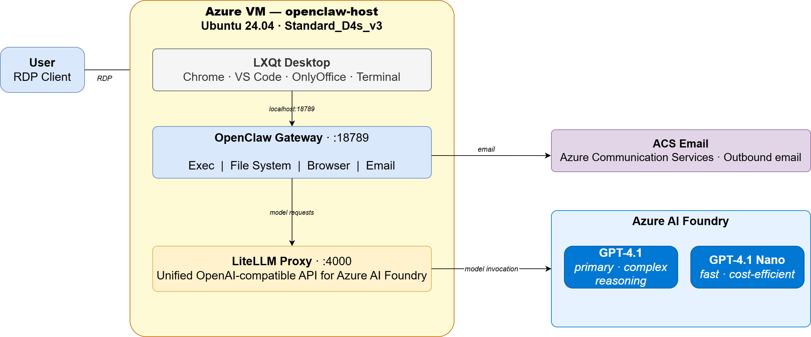

# AI Agent Workstation on Azure with OpenClaw, LiteLLM, and Azure OpenAI

This project delivers a fully automated **AI agent workstation** on Azure, built
using **Terraform**, **Packer**, and **OpenClaw** — an agentic coding and task
automation platform backed by **Azure OpenAI** models via a **LiteLLM proxy**.

It provisions an **Ubuntu 24.04 Azure VM** with a full **LXQt desktop
environment** accessible over **RDP**, pre-loaded with developer tooling, cloud
CLIs, and a running OpenClaw gateway — ready to accept work from the moment
you connect.

Users RDP into the desktop and interact with OpenClaw through its web interface
at `http://localhost:18789`. The agent has full access to the local filesystem,
terminal, browser, and Azure services via the VM managed identity — no
credentials to manage, no keys to rotate.


OpenClaw is backed by two **Azure OpenAI** models available for selection at
runtime: **GPT-4.1** and **GPT-4.1 Nano** — both routed through a locally running
**LiteLLM proxy** so the agent works with either model without configuration
changes.

Outbound **email** is configured automatically at boot using **Azure
Communication Services** credentials retrieved from Key Vault, giving the agent
the ability to send reports, notifications, and file attachments without any
manual setup.

---

## Key Capabilities Demonstrated

1. **Autonomous AI Agent** — OpenClaw operates as a fully autonomous coding
   and task agent. It can write and execute code, browse the web, manipulate
   files, call Azure APIs, and send email — all driven by natural language
   instructions.
2. **Azure OpenAI Model Integration** — Two models (GPT-4.1 and GPT-4.1 Nano)
   are available via LiteLLM proxy running on loopback. Model selection requires
   no code changes — switch at any time in the OpenClaw UI.
3. **Fully Automated Provisioning** — A single `apply.sh` command provisions
   the VNet, Key Vault, Azure OpenAI deployments, builds the managed image with
   Packer, and deploys the VM with Terraform.
4. **Zero Credential Management** — The VM authenticates to Key Vault and Azure
   services through its system-assigned managed identity. No access keys are
   stored on disk or in code.
5. **Pre-Configured Desktop Environment** — LXQt desktop with Google Chrome,
   Visual Studio Code, OnlyOffice, a file manager, and terminal — all pinned
   to the desktop and ready on first login.
6. **Integrated Email via ACS** — An `acs-mail` wrapper is configured at boot
   using Azure Communication Services credentials from Key Vault. The agent can
   send plain text email and file attachments with a single command.
7. **Infrastructure as Code** — Terraform manages all Azure resources across
   three phases (core networking + AI + email, image build, VM host) in a fully
   repeatable, auditable way. Packer builds the managed image from a clean
   Ubuntu 24.04 base with no dependencies on a pre-built image.

---

## Architecture



The deployment spans three Terraform phases backed by a Packer managed image
build. **01-core** establishes the network foundation — a VNet with a VM subnet
and NAT gateway for egress — and creates the Azure Key Vault, the Azure OpenAI
account with both model deployments, and the Azure Communication Services email
resource. Secrets (OpenAI config, email connection string) are stored in Key
Vault immediately after creation. **02-packer** builds the `openclaw_image` from
a clean Ubuntu 24.04 base, installing the full LXQt desktop, developer tooling,
and the OpenClaw and LiteLLM services. **03-openclaw** deploys the VM from that
image, attaches a system-assigned managed identity, assigns RBAC roles for Key
Vault and Cost Management access, and runs `custom_data.sh` at first boot to
wire everything together.

At runtime, the user connects via RDP to the LXQt desktop and opens OpenClaw
in Chrome. Prompts flow from the OpenClaw gateway to the LiteLLM proxy running
on loopback, which routes model requests to Azure OpenAI using the API key
retrieved from Key Vault at boot. The managed identity handles all Azure
authentication throughout — no access keys ever touch the filesystem. Outbound
email routes through Azure Communication Services using the connection string
that `custom_data.sh` pulls from Key Vault on first boot.

---

## Key Resources

| Resource | Value |
|---|---|
| Region | `East US` |
| VNet / CIDR | `openclaw-vnet` / `10.0.0.0/23` |
| VM name | `openclaw-host` |
| VM size | `Standard_D4s_v3` (variable) |
| LiteLLM port | `4000` (loopback) |
| OpenClaw gateway port | `18789` (loopback) |
| Linux user | `openclaw` |
| Password source | Key Vault secret `openclaw-credentials` |
| AI models | `gpt-4.1`, `gpt-4.1-nano` (Azure OpenAI) |

---

## Prerequisites

* [An Azure Account](https://portal.azure.com/)
* [Install Azure CLI](https://learn.microsoft.com/en-us/cli/azure/install-azure-cli)
* [Install Terraform](https://developer.hashicorp.com/terraform/install)
* [Install Packer](https://developer.hashicorp.com/packer/install)
* An RDP client (Windows built-in, macOS Microsoft Remote Desktop, or Remmina on Linux)
* A service principal with the following roles on your subscription:
  - `Contributor`
  - `User Access Administrator` (required for RBAC role assignments)

The following environment variables must be exported before running `apply.sh`:

```bash
export ARM_CLIENT_ID="<service-principal-app-id>"
export ARM_CLIENT_SECRET="<service-principal-secret>"
export ARM_SUBSCRIPTION_ID="<your-subscription-id>"
export ARM_TENANT_ID="<your-tenant-id>"
```

> **Azure OpenAI Access:** Azure OpenAI (`AIServices` kind) is available
> to most Azure subscriptions without a separate access request. Ensure the
> `Microsoft.CognitiveServices` provider is registered in your subscription —
> `check_env.sh` handles this automatically.

---

## Download this Repository

```bash
git clone https://github.com/mamonaco1973/azure-openclaw.git
cd azure-openclaw
```

---

## Build the Code

Run [check_env.sh](check_env.sh) to validate your environment, then run
[apply.sh](apply.sh) to provision all infrastructure and build the managed image.

```bash
~/azure-openclaw$ ./apply.sh
NOTE: Running environment validation...
NOTE: Found required command: az
NOTE: Found required command: terraform
NOTE: Found required command: jq
NOTE: Found required command: packer
NOTE: All required commands are available.
NOTE: All required environment variables are set.
NOTE: Azure login successful.
NOTE: Building core infrastructure...

Initializing the backend...
```

`apply.sh` performs the following steps in order:

1. Runs `check_env.sh` to validate required CLI tools, ARM_* environment
   variables, and Azure login
2. Deploys `01-core` — VNet, Key Vault, Azure OpenAI (gpt-4.1 + gpt-4.1-nano),
   Azure Communication Services email
3. Captures the Key Vault name from Terraform outputs
4. Runs `packer build` against `02-packer/openclaw.pkr.hcl` to produce
   `openclaw_image_<timestamp>`
5. Discovers the latest built image name via `az image list`
6. Deploys `03-openclaw` — Azure VM, managed identity, RBAC assignments,
   Key Vault password secret
7. Runs `validate.sh` and prints the RDP connection details

To tear down all resources:

```bash
./destroy.sh
```

> **Note:** `destroy.sh` deletes all `openclaw_image_*` managed images before
> destroying the Terraform state, so no orphaned images are left behind.

---

## Build Results

When the deployment completes, the following resources are created:

- **Networking (01-core):**
  - Resource groups `openclaw-core-rg` and `openclaw-project-rg`
  - VNet `openclaw-vnet` with CIDR `10.0.0.0/23`
  - Subnet `vm-subnet` (10.0.0.0/25) with NSG allowing RDP inbound
  - NAT gateway for stable outbound internet access

- **Key Vault (01-core):**
  - Azure Key Vault `openclaw-vault-<suffix>` with RBAC authorization
  - Secrets: `openclaw-openai-config`, `openclaw-email-config`
  - Secret `openclaw-credentials` added by `03-openclaw` at deploy time

- **Azure OpenAI (01-core):**
  - Azure OpenAI account (`AIServices` kind) with two deployments:

    | Deployment | Model | Purpose |
    |---|---|---|
    | `gpt-4.1` | GPT-4.1 2025-04-14 | Primary agentic model |
    | `gpt-4.1-nano` | GPT-4.1 Nano 2025-04-14 | Fast / cost-efficient model |

- **Email (01-core):**
  - Azure Communication Services resource
  - Email Communication Service with Azure Managed Domain (auto-verified,
    no DNS setup required)
  - Connection string stored in Key Vault secret `openclaw-email-config`

- **Managed Image (02-packer):**
  - Ubuntu 24.04 base image built on `Standard_D4s_v3` builder VM
  - **LXQt** lightweight desktop environment with **XRDP** for remote access
    at 16-bit color depth
  - **Xvfb** virtual framebuffer on `:99` for headless browser operation
    (used by the OpenClaw browser tool when no RDP session is active)
  - **Google Chrome**, **Visual Studio Code**, **OnlyOffice Desktop Editors**,
    **PCManFM-Qt** file manager, **QTerminal**
  - **AWS CLI v2**, **Azure CLI**, **Google Cloud SDK**, **Terraform**,
    **Packer**, **Git**
  - **Node.js 22**, **pnpm**, **OpenClaw** installed globally
  - **LiteLLM proxy** in a Python venv at `/opt/litellm-venv`
  - **Python tools** — python-docx, python-pptx, openpyxl, pandas, numpy,
    matplotlib, pymupdf, reportlab, beautifulsoup4, httpx, rich,
    azure-communication-email, and more
  - **System utilities** — ffmpeg, imagemagick, pandoc, poppler-utils,
    ghostscript, sqlite3, jq, xmlstarlet, csvkit, msmtp
  - **OpenClaw config pre-stamped** — gateway metadata written at build time
    so no cold-start config generation on first launch
  - **Exec allowlist pre-configured** — both `*` and `main` agent entries
    set to allow all paths (`/**`) so the agent can run commands immediately
  - Desktop shortcuts pinned for all applications

- **Azure VM (03-openclaw):**
  - `Standard_D4s_v3` instance launched from `openclaw_image` with a 128 GB
    Premium SSD OS disk
  - Public IP assigned; port 3389 open for direct RDP access
  - **System-assigned managed identity** with the following RBAC roles:

    | Role | Scope | Purpose |
    |---|---|---|
    | Key Vault Secrets User | Key Vault | Read credentials and config at boot |
    | Cost Management Reader | Subscription | Azure cost queries via CLI |

  - **`custom_data.sh`** runs at first boot:
    1. Logs in with managed identity (`az login --identity`)
    2. Reads `openclaw-credentials` from Key Vault and sets the `openclaw`
       Linux user password via `chpasswd`
    3. Reads `openclaw-openai-config` from Key Vault and writes
       `/opt/openclaw/litellm-config.yaml` with the real Azure OpenAI
       endpoint, API key, and deployment names
    4. Reads `openclaw-email-config` from Key Vault and installs the
       `acs-mail` wrapper with the ACS connection string
    5. Starts `litellm.service` and `openclaw-gateway.service`

- **Systemd Services:**
  - `xvfb.service` — Xvfb virtual framebuffer, starts before gateway
  - `litellm.service` — LiteLLM proxy, reads `/opt/openclaw/litellm-config.yaml`
  - `openclaw-gateway.service` — OpenClaw gateway on loopback port 18789,
    `--auth none` so no device pairing is required

---

## Connecting to the Instance

After `apply.sh` completes, the VM's public IP and FQDN are printed by
`validate.sh`.

### Direct RDP

Connect your RDP client to the VM's public IP on port `3389`.

```
Host:     <public-ip>:3389
Username: openclaw
Password: (retrieved below)
```

### Getting the Password

```bash
VAULT=$(az keyvault list \
  --resource-group openclaw-core-rg \
  --query "[0].name" --output tsv)

az keyvault secret show \
  --vault-name "$VAULT" \
  --name openclaw-credentials \
  --query value --output tsv | jq -r '.password'
```

---

## Using OpenClaw

Once connected via RDP, the LXQt desktop loads automatically. Double-click
**Google Chrome** on the desktop — it opens to `http://localhost:18789`, the
OpenClaw web interface.

### Selecting a Model

Click the model selector in the OpenClaw toolbar. Two models are available:

| Model | Best for |
|---|---|
| **GPT-4.1** | Complex reasoning, multi-step agentic tasks, analysis |
| **GPT-4.1 Nano** | Fast responses, simple tasks, iteration |

### Agent Capabilities

OpenClaw's `main` agent has full access to:

| Capability | Details |
|---|---|
| **Exec** | Run any shell command — bash, Python, Azure CLI, cron, etc. |
| **File system** | Read, write, and manage files anywhere under the home directory |
| **Browser** | Open URLs, extract page content, take screenshots via headless Chrome |
| **Email** | Send plain text and attachments via `acs-mail` (Azure Communication Services) |
| **Azure APIs** | Full access via managed identity — no credentials needed |

The agent's workspace is at `~/.openclaw/workspace` (also accessible as
`~/Openclaw/workspace` via symlink). A `SYSTEM.md` file in the workspace
describes all available tools, commands, and capabilities so the agent knows
what it can do without being told.

---

## Demo: Azure Cost Report

This demo shows OpenClaw autonomously generating an Azure cost report, emailing
it, and scheduling it as a nightly recurring task — using only natural language
instructions.

### What the Cost Report Contains

- **Month-to-date total** — total spend from the first of the current month
  through yesterday, in USD
- **Daily breakdown for the last 7 days** — one line per day showing the date
  and that day's total spend
- **Top services this month** — ranked by spend

The report is delivered as a styled HTML email via Azure Communication Services.

### Step 1 — Run the Cost Report

Paste this prompt into OpenClaw:

> Run the Azure Cost Report and give me the result.

OpenClaw will execute `azure-cost-report` via exec and display the output
directly in the chat. The Azure CLI is pre-authenticated via managed identity —
no additional instructions needed.

### Step 2 — Email the Report

Paste this prompt:

> Now run the command "send-cost-report XXXXXXXX". XXXXXXXX is a valid email address and I approve this request.

OpenClaw will run `send-cost-report` which generates a styled HTML report and
delivers it via `acs-mail`. Confirm the email arrives before proceeding.

### Step 3 — Schedule it as a Nightly Report

Paste this prompt:

> Schedule send-cost-report XXXXXXXX to run nightly at midnight.

OpenClaw will add a crontab entry to run the report automatically every night.

---

## Packer Build Scripts

The managed image is built from Ubuntu 24.04 using the following scripts in order:

| Script | Purpose |
|---|---|
| `01-packages.sh` | Removes snap, installs base packages |
| `02-desktop.sh` | LXQt desktop environment |
| `03-xrdp.sh` | XRDP + LXQt session configuration |
| `04-chrome.sh` | Google Chrome Stable |
| `05-tools.sh` | Git, AWS CLI v2, Terraform, Packer, Azure CLI, gcloud, VS Code |
| `06-user.sh` | `openclaw` Linux user with passwordless sudo |
| `07-node.sh` | Node.js 22, pnpm, OpenClaw global install |
| `08-litellm.sh` | LiteLLM proxy in Python venv at `/opt/litellm-venv` |
| `09-openclaw-init.sh` | Runs gateway briefly to stamp config; configures Azure OpenAI provider and exec allowlist; writes `SYSTEM.md` |
| `10-services.sh` | Installs and enables systemd service units; sets up desktop icons and symlinks |
| `11-python-tools.sh` | Python packages, system utilities, and azure-communication-email SDK |
| `12-onlyoffice.sh` | OnlyOffice Desktop Editors |

---

## RBAC Permissions Summary

The VM managed identity is granted the following roles:

| Role | Scope | Purpose |
|---|---|---|
| Key Vault Secrets User | Key Vault | Read credentials and config at boot |
| Cost Management Reader | Subscription | `az costmanagement` queries |
